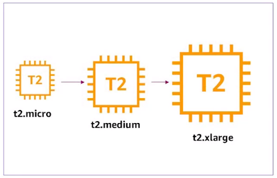
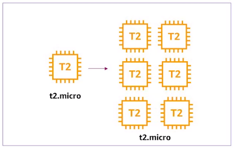

Se entiende por escalabilidad a la capacidad de adaptación y respuesta de un sistema con respecto al rendimiento del mismo a medida que aumentan de forma significativa el número de usuarios del mismo. Aunque parezca un concepto claro, la escalabilidad de un sistema es un aspecto complejo e importante del diseño.

La escalabilidad esta íntimamente ligada al diseño del sistema. Influye en el rendimiento de forma significativa. Si una aplicación esta bien diseñada, la escalabilidad no constituye un problema. Analizando la escalabilidad, se deduce de la implementación y del diseño general del sistema. No es atributo del sistema configurable.

La escalabilidad supone un factor crítico en el crecimiento de un sistema. Si un sistema tiene como objetivo crecer en el numero de usuarios manteniendo su rendimiento actual, tiene que evaluar dos posibles opciones:

- Con un hardware de mayor potencia o
- Con una mejor combinación de hardware y software.

Se pueden distinguir dos tipos de escalabilidad, vertical y horizontal

## Escalamiento Vertical
Es cuando aumentamos los recursos de un componente para que sea más potente. Por ejemplo, migrar de una instancia `t2.micro` a una instancia `t2.medium`

## Escalamiento Horizontal
Es cuando aumentamos la cantidad de servidores/instancias de un mismo tipo para manejar el crecimiento de la demanda de nuestra aplicación (puede que tengamos que usar un load balancer o balanceador de carga en español para poder distribuir la carga entre las distintas instancias). Por ejemplo, crear seis instancias del tipo `t2.micro` para una aplicación que acaba de aumentar su número de usuarios en un 500%.

> ***Nota**: Al utilizar este tipo de escalamiento cada una de las instancias ejecutará una copia de nuestra aplicación, por lo que es importante tener en cuenta varios temas, uno de ellos es la sesión de los usuarios, para ellos nosotros podemos activar la opción "Sticky Session" dentro de AWS Elastic Load Balancer, para manejar las sesiones entre las instancias*

