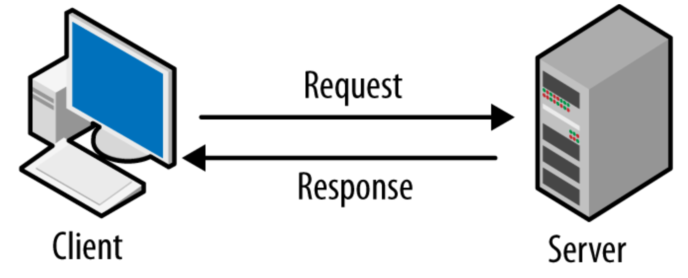
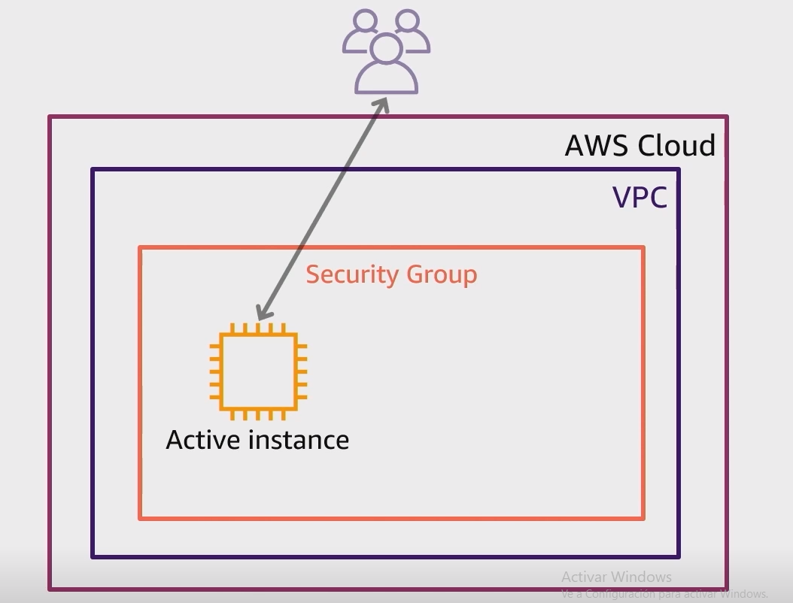
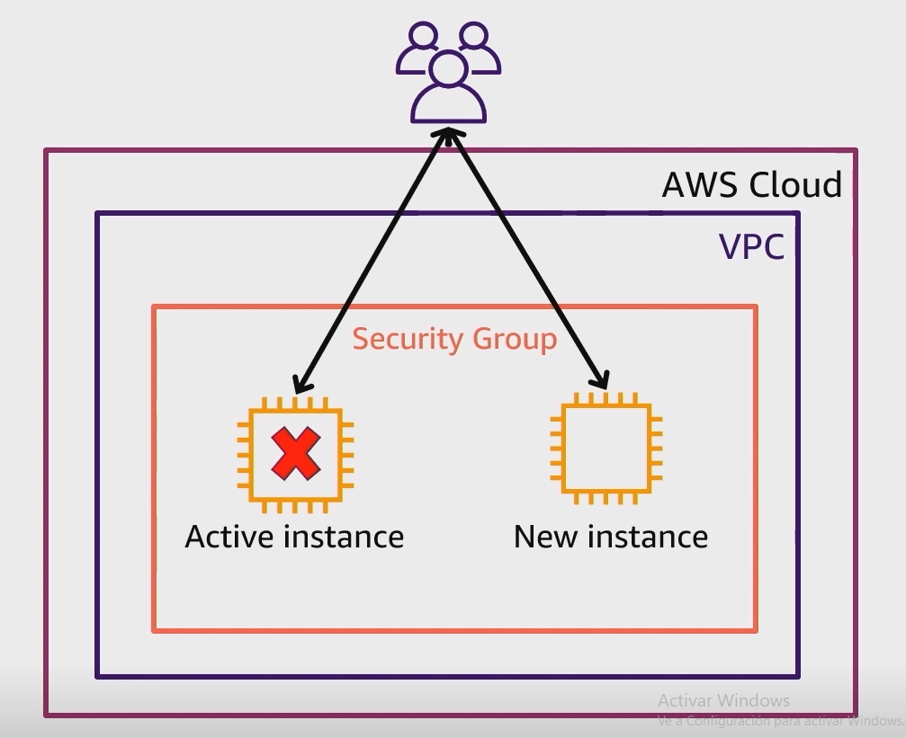
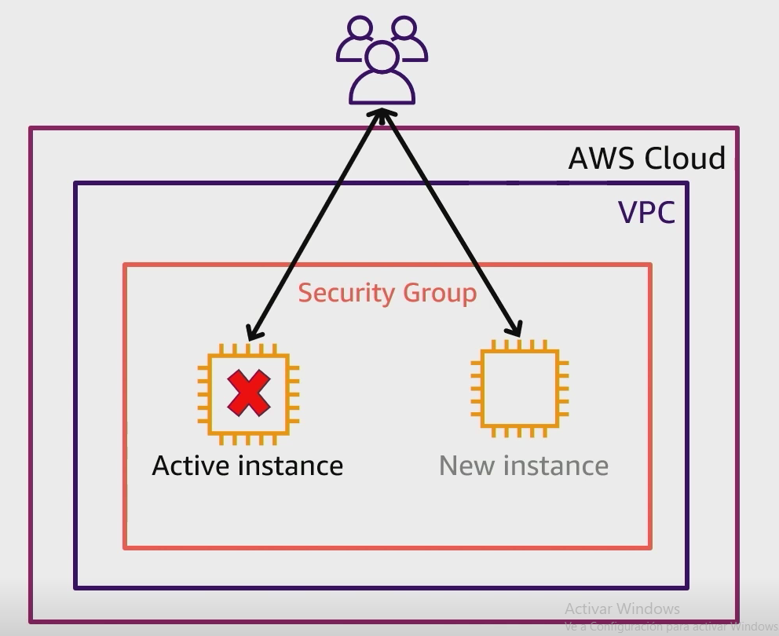
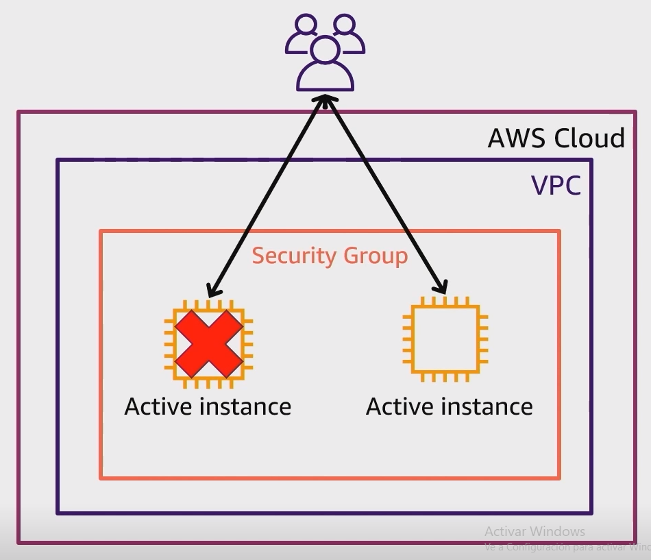
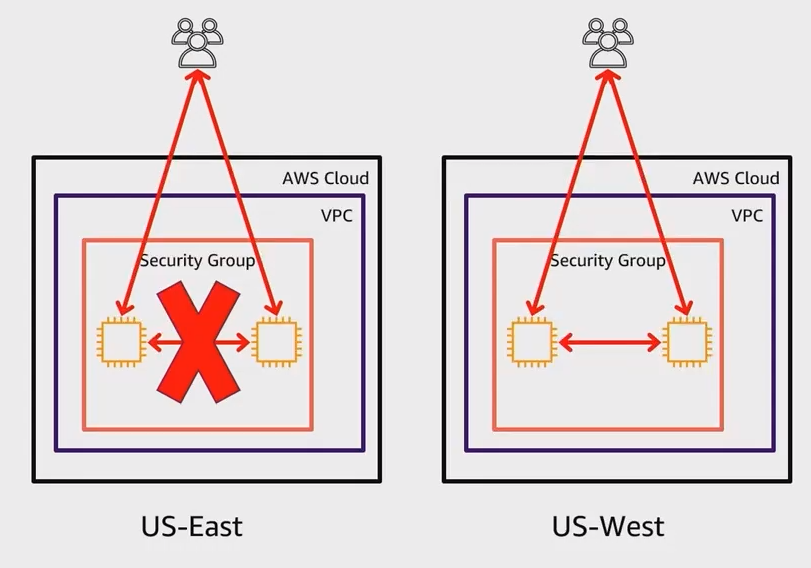

# Módulo 01

**Tabla de contenido**

- [Modelo Cliente - Servidor](#Modelo%20Cliente%20-%20Servidor)
- [Cómputo en la nube](#C%C3%B3mputo%20en%20la%20nube)
	- [Modelos de informática en la nube](#Modelos%20de%20inform%C3%A1tica%20en%20la%20nube)
		- [Infraestructura como servicio (IaaS)](#Infraestructura%20como%20servicio%20(IaaS))
		- [Plataforma como servicio (PaaS)](#Plataforma%20como%20servicio%20(PaaS))
		- [Software como servicio (SaaS)](#Software%20como%20servicio%20(SaaS))
	- [Modelos de implementación](#Modelos%20de%20implementaci%C3%B3n)
		- [Implementación basada en la nube](#Implementaci%C3%B3n%20basada%20en%20la%20nube)
		- [Implementación en las instalaciones](#Implementaci%C3%B3n%20en%20las%20instalaciones)
		- [Implementación híbrida](#Implementaci%C3%B3n%20h%C3%ADbrida)
- [Beneficios del cómputo en la nube](#Beneficios%20del%20c%C3%B3mputo%20en%20la%20nube)

## Modelo Cliente - Servidor

El `cliente` puede ser desde un navegador web hasta una persona. Lo importante es que este cliente realiza una solicitud al `servidor`, donde este último puede ser un servidor virtual, físico o algún servicio de AWS, como por ejemplo AWS EC2.

**Ejemplo:** Para poder entender mejor este modelo pensemos en un restaurante, donde la persona que hace su pedido vendría a ser el `cliente`, y la cocina que se encarga de revisar si hay disponibilidad y entregar el pedido si es así, vendría a ser el `servidor`.

## Cómputo en la nube

El concepto de **nube** hace referencia a los recursos TI que pueden ser entregados bajo demanda y solicitados a través de internet con un modelo de precio de pago por uso.

Es decir, AWS (la nube en este caso) nos brinda los recursos que queremos cuando los necesitamos. De igual forma, si ya no queremos algún recurso, simplemente con un clic lo deshabilitamos e inmediatamente dejamos de pagar por ese recurso.

En resumen, podemos definir el cómputo en la nube en AWS con los siguientes puntos:

1. **Auto servicio bajo demanda**: ya como hemos mencionado, podemos solicitar y deshabilitar recursos cuando lo necesitemos.
2. **Acceso a internet**: Los recursos los podemos solicitar desde la consola de AWS (en un navegador como Google Chrome), usando una interfaz de línea de comandos, o usando una API (Application Programming Interface)
3. **Recursos compartidos/agrupados**: AWS provee una basta cantidad de recursos para servir a una gran cantidad de clientes.
4. **Elasticidad**: Es la capacidad de poder escalar nuestros recursos en AWS en base a la demanda que tengamos, si la demanda aumenta nosotros podemos hacer que nuestros recursos escalen para poder soportar esa demanda, si esa demanda disminuye nosotros podemos disminuir nuestros recursos para no estar pagando de más.

	Básicamente es hacer que el  sea automático
 
5. **Monitoreo y facturación de uso de recursos**: con AWS nosotros podemos monitorear el uso de nuestros recursos y controlar la facturación de estos.

### Modelos de informática en la nube

Existen tres modelos principales de informática en la nube. Cada modelo representa una parte distinta de la pila de informática en la nube.

#### Infraestructura como servicio (IaaS)

La infraestructura como servicio (IaaS) constituye los bloques esenciales para la infraestructura en la nube, proporcionando acceso a funciones de red, máquinas virtuales, almacenamiento de datos y ofreciendo un alto nivel de flexibilidad y control en la gestión de recursos de TI. Se asemeja a los recursos de TI tradicionales, siendo familiar para muchos departamentos de TI y desarrolladores.

**Ejemplos**: Amazon Web Services (AWS), Microsoft Azure, Google Cloud Platform (GCP)

#### Plataforma como servicio (PaaS)

Las plataformas como servicio (PaaS) liberan a las empresas de la gestión de la infraestructura subyacente, permitiéndoles concentrarse en la implementación y administración de aplicaciones. Esto mejora la eficacia al eliminar preocupaciones como el aprovisionamiento de recursos, la planificación de capacidad y el mantenimiento de software, simplificando la ejecución de aplicaciones.

**Ejemplos**: [Heroku](https://www.heroku.com/what), [Google App Engine](https://cloud.google.com/appengine?hl=es-419), [Microsoft Azure App Service](https://learn.microsoft.com/es-es/azure/app-service/overview)
#### Software como servicio (SaaS)

El software como servicio (SaaS) proporciona un producto completo gestionado por el proveedor del servicio, especialmente aplicaciones de usuario final. Con SaaS, los usuarios no deben preocuparse por el mantenimiento del servicio o la gestión de la infraestructura subyacente. Solo necesitan centrarse en el uso de la aplicación. Un ejemplo común es un programa de correo electrónico basado en la web, donde los usuarios pueden enviar y recibir mensajes sin preocuparse por la administración de funciones ni el mantenimiento de servidores y sistemas operativos.

**Ejemplos**: Microsoft 365, [Salesforce](https://www.salesforce.com/mx/products/what-is-salesforce/), Google Workspace (Docs, Sheets, Presentations, Gmail, etc)
### Modelos de implementación

Existen tres modelos de implementación de la nube: implementación basada en la nube, implementación en las instalaciones e implementación híbrida.

#### Implementación basada en la nube

- Ejecución de todas las partes de una aplicación en la nube
- Migración de las aplicaciones existentes a la nube
- Diseño y creación de nuevas aplicaciones en la nube

Por ejemplo: una empresa podría crear una aplicación compuesta por servidores virtuales, bases de datos y componentes de red totalmente basados en la nube.

#### Implementación en las instalaciones

También conocida como implementación en la ***nube privada***.

- Implementación de recursos mediante herramientas de virtualización y administración de recursos
- Aumento de la utilización de recursos mediante tecnologías de virtualización y administración de aplicaciones

**Por ejemplo**: es posible que tenga aplicaciones que se ejecutan con tecnología que se almacena por completo en su centro de datos local. Aunque este modelo se parece mucho a la [infraestructura de TI heredada](https://blog-es.lac.tdsynnex.com/infraestructura-heredada-por-que-puede-costar-muy-caro-y-como-solucionar-el-problema), su incorporación de tecnologías de virtualización y administración de aplicaciones ayuda a aumentar la utilización de los recursos.
#### Implementación híbrida

- Conexión de los recursos basados en la nube a la infraestructura en las instalaciones
- Integración de los recursos basados en la nube con aplicaciones TI heredadas

**Por ejemplo**: supongamos que una empresa desea utilizar servicios en la nube que pueden automatizar el procesamiento y el análisis de datos por lotes. Sin embargo, la empresa tiene varias aplicaciones heredadas que son más adecuadas en las instalaciones y no se migrarán a la nube. Con una implementación híbrida, la empresa podría mantener las aplicaciones heredadas en las instalaciones y beneficiarse de los servicios de datos y análisis que se ejecutan en la nube.

## Beneficios del cómputo en la nube

#### Cambiar gastos iniciales por gastos variables

Gastos iniciales implican inversiones previas en infraestructura, mientras que los gastos variables en la nube permiten pagar solo por lo que se consume, favoreciendo la innovación y ahorro de costos empresariales.

####  Dejar de gastar dinero en la ejecución y mantenimiento de centros de datos

El cómputo en centros de datos implica mayores costos y tiempo dedicado a la gestión de infraestructura y servidores. En contraste, la computación en la nube ofrece la ventaja de liberar recursos para concentrarse menos en estas tareas y más en el desarrollo de aplicaciones y la satisfacción de los clientes.

#### Dejar de hacer conjeturas sobre la capacidad
  
La computación en la nube permite adaptar la capacidad de infraestructura según la demanda real al lanzar instancias con servicios como Amazon EC2. Pagar únicamente por el tiempo de cómputo utilizado evita costos en recursos infrautilizados, brindando flexibilidad para ajustar la capacidad en respuesta a cambios de demanda, ya sea reduciendo o escalando horizontalmente.

#### Obtener beneficios de grandes economías de escala

La adopción del cómputo en la nube permite obtener un costo variable más bajo en comparación con la gestión independiente. La capacidad de agregar el uso de cientos de miles de clientes en la nube posibilita a proveedores como AWS beneficiarse de economías de escala, resultando en tarifas más bajas gracias a la mayor eficiencia y distribución de costos a lo largo de una amplia base de usuarios.
#### Aumentar velocidad y agilidad

La flexibilidad de la computación en la nube facilita el desarrollo e implementación de aplicaciones, brindando más tiempo para experimentar e innovar. A diferencia de los centros de datos, donde obtener nuevos recursos puede llevar semanas, la nube permite acceder a ellos en cuestión de minutos.

#### Convertirse en una empresa global en cuestión de minutos
  
La amplia presencia global de la nube de AWS permite una rápida implementación de aplicaciones para clientes de todo el mundo, garantizando baja latencia. Esto posibilita que los clientes accedan a las aplicaciones con mínimos retrasos, incluso si se encuentran en diferentes partes del mundo. 

## Infraestructura global de AWS

Los conceptos relevantes para este primer dominio son las regiones, availability zones y edge locations. Para beneficiarnos de esta infraestructura global necesitamos que nuestras aplicaciones sean diseñadas para: gran disponibilidad, tolerancia a fallos y recuperación a desastres.

#### Gran disponibilidad (High availability)
Con esto nos referimos a que nuestra aplicación pueda responder rápidamente a cualquier error que suceda, con el objetivo que nuestra app siga funcionando. No importa si nuestra aplicación deja de funcionar por un tiempo (corto). 

Ejemplo: 

Supongamos que tenemos una aplicación ejecutándose dentro de un servidor en AWS la cual es usada por nuestros empleados para hacer su trabajo

Si este servidor se "cae" (deja de funcionar) entonces los empleados no pueden hacer su trabajo. Si diseñamos nuestra aplicación para que sea "altamente disponible", entonces podríamos rápidamente levantar otro servidor de respaldo que pueda usar la aplicación para que nuestros empleados sigan haciendo su trabajo.

Incluso podríamos haber definido desde el inicio dos servidores, uno donde la aplicación se ejecute (sería un servidor un modo activo) y otro de respaldo (sería un servidor en modo espera), de esta forma cuando el servidor activo se "caiga", el servidor en modo de espera entraría en acción para hacer que la aplicación siga funcionando.

Esto puede ocasionar que nuestros empleados necesiten iniciar sesión nuevamente, lo cual quiere decir que nuestra aplicación estuvo "caída" por un corto tiempo, lo que es aceptado cuando nuestra aplicación está diseñada para tener una alta disponibilidad.

#### Tolerancia a fallos (Fault tolerance)
Es similar a cuando nuestra aplicación está diseñada para una alta disponibilidad, pero en este caso la aplicación ya no tiene ningún tiempo de "caida", es decir, nuestra aplicación seguirá funcionando incluso si se presenta algún error.

> ***Nota**: Diseñar nuestra aplicaciones para que tengan tolerancia a fallos generalmente resulta ser más caro que diseñar nuestras aplicaciones para que tengan alta disponibilidad. Elegir entre una u otra dependerá del tipo de aplicación que estemos desarrollando.*

Ejemplo:

Retomemos el ejemplo anterior, si diseñáramos la aplicación para que tenga tolerancia a fallos tendríamos que tener dos servidores (instancias) en modo activo, de esta forma nuestra aplicación se ejecuta en esas dos instancias al mismo tiempo y si una de las dos deja de funcionar la aplicación se sigue ejecutando pero solo en una de las instancias, sin necesidad de que los empleados tengan que iniciar sesión nuevamente.

#### Recuperación a desastres (Disaster recovery)
Este sistema de diseño es diferente a los dos anteriores, ya que en este caso nos referimos a que nuestra aplicación debe ser capaz de seguir funcionando incluso si ocurre un desastre. Para ello debemos contar con un plan que contenga pasos a seguir para hacer todo el proceso mucho más fácil.

> Este sistema de diseño en AWS hace referencia por ejemplo a que si nuestra aplicación se está ejecutando dentro de la región US-East, y dentro de esa región ocurre un desastre o un fallo masivo que hace que nuestra aplicación deje de funcionar, nosotros deberíamos ser capaces de "migrar" o "llevar" nuestra aplicación hacia otra región dentro de AWS, por ejemplo US-West, de tal forma que nuestra aplicación siga funcionando.

